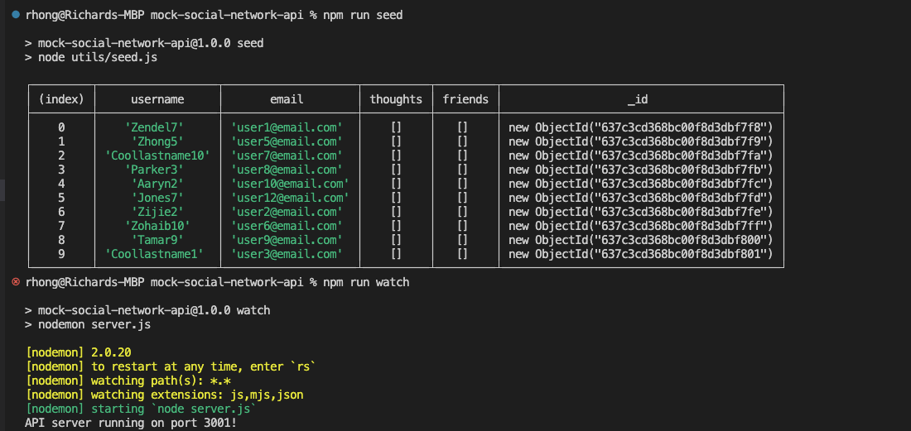
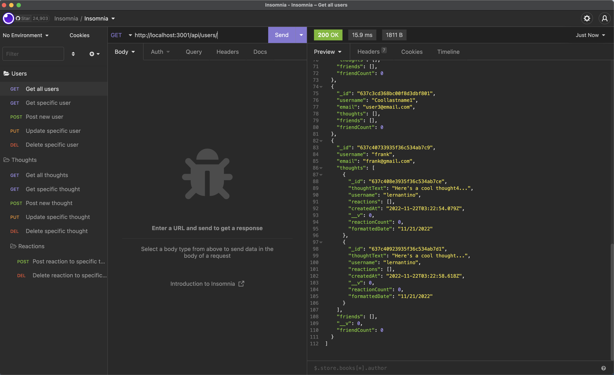

# Mock Social Network API

[](https://opensource.org/licenses/MIT)

## Description
This app simulates a social network's Mongo database with API calls to interact with users, thoughts, and reactions to thoughts.

## Technologies
This app is built with [Node.js](https://nodejs.org/en/), [Express](https://expressjs.com/) (version 4.18.2), [mongoose](https://mongoosejs.com/) (version 6.7.2), and [nodemon](https://www.npmjs.com/package/nodemon) (version 2.0.20).

## Table of Contents
  - [Installation](#installation)
  - [Usage](#usage)
  - [Architecture](#architecture)
  - [Video Demo](#demo)
  - [Screenshot](#screenshot)
  - [License](#license)
  - [Questions](#questions)

## Installation

The user needs to have Mongo installed; instructions can vary based on the operating system. The following command can show if it is already installed:

```
mongo --version
```
After cloning the repository, the user should run the following command within the terminal:
```
npm install
```
Afterwards check towards the bottom within package.json; the user should see the following within the dependencies object:

```
...
   "dependencies": {
    "express": "^4.18.2",
    "mongoose": "^6.7.2",
    "nodemon": "^2.0.20"
  }
```

## Usage
After installing Express, Mongo, mongoose, and nodemon, the user should run the following commands within the terminal:
```
npm run seed
```
After seeding a mock database, the user can run the following command:
```
npm run watch
```

After running the command, the user should expect to see something similar within his/her terminal:



## Architecture
For this program, the logic is mostly spread amongst three folders: 
  * models
    - Mongoose Schemas and Models are defined here along with how documents are nested within other Schemas e.g. Thought Schemas are stored within an array of a User
  * routes
    - Different routes are defined here which efectively map imported functions from controllers to handle different API requests (GET, POST, PUT, DELETE) for each API route.
  * controllers
    - Multiple functions are defined here and then exported into routes for appropriate logic; These functions act as CRUD operations and handle the different mongoose interactions between the different Schemas/Models

## Screenshot


## License
This app was licensed under the MIT License.

## Questions
Questions, comments, concerns? Send me an email at rhong24@gmail.com.


## Demo
[Video](https://drive.google.com/file/d/1IgOfKsyLt1RkmUnWRs-N4AkdPqfx_N7C/view)